# Fluid Dynamics Simulator
Yap abt project

## First Implementation
I chose a Smoothed-particle hydrodynamic model for my first implementation because handling the fluid as a set of particles was more familiar to me. This is known as a Lagrangian approach due to the "computational mesh" or fluid being a collection of individual points with their own data that is manipulated according the equations that govern the system. This means its **a** easier to handle free surfaces like breaking waves, **b** we can kinda ignore mass conservation, **c** interactions with other moving bodies are easy, and fluid properties are easy.

**a**) It's particle based so boundaries are defined inherently - so basically it solves itself

**b**) Each particle has the same mass \
No mass enters/exits the system

**c**) Same logic as **a**. These interactions are calculated based on nearby particles

### Understanding the math
Yap abt how I suck at math so other people derived the equations for me and it was still hard to understand

#### Finding density
This is done by looping through all the particles and for each particle **i**, we loop through all the particles again **j** and sum their density contributions, apply some weight to it and multiply by the mass **m** of particle **j**.\
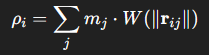\
**r** is the vector pointing from particle **i** to particle **j** so ||**r**|| is the distance between the two particles.\
\
**W** is the smoothing kernel, which is a type of weighted moving average. This spreads the influence of one particle over some small radius **h**. Particles outside that radius will be ignored. **k** is the kernel constant for the poly6 kernel, which was designed by Müller et al for particle density approximations.\
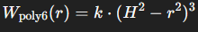

#### Finding pressure
Since the density at each point is known, the pressure can then be solved for using an approximation of the Tait Equation of State. **k** is the gas constant and **ρ**0 is the density at equilibrium. This can be linearized as: \
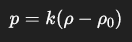

#### Calculating Forces
We want to find the total force for every particle. We do so by summing the forces due to pressure, viscosity, and gravity. \
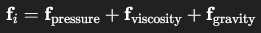 \
Once again we loop through all particles **i**, and for each **i**, we loop through all other particles **j** and sum their pressure, viscosity force contributions.
##### Pressure
In our simulation, pressure is responsible for the force that pushes particles from regions of high concentration to regions of low concentration. Mathematically, this is represented as a gradient, whose value at a point gives the direction and magnitude of the maximum rate of increase. So the pressure can be represented by: \
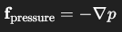 \
But we are dealing with a bunch of particles, not a continuous field, so we must adapt it for a discrete field. \
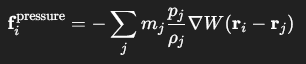 \
But this force is not symmetric, which will lead to an unstable fluid. The symmetrical form of the force on particle **i** due to particle **j** is: \
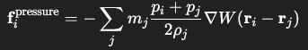 \
**W** is now a gradient of the Spiky smoothing kernel, where **h** is the same as earlier.\
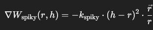

##### Viscosity
Viscosity is a fluid's resistance to flow. Imagine identical two streams of water inside a box clashing against each other. We know momentum is always conserved in a collision, so the fluid must eventually come to rest because the net momentum is zero before the collision (assuming identical water streams). In a continuous fluid this is represented as the laplacian of the velocity field, which is basically how much the gradient changes around a point (kinda like local extrema). The force also depends on **η**, the dynamic viscosity coefficient. This interaction is known as momentum diffusion. \
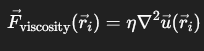 \
Of course this must be discretized and stablized \
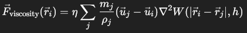 \
Note the influence of the neighbors mass and density must be accounted for, as well as the velocity difference. Another smoothing kernel **W** is used, but now the laplacian is applied to it instead of the velocity due to the discretization. This will dictate how the velocity is to "smooth out" over space. \
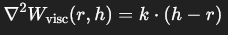

##### Gravity
Remember to divide the force of gravity **mg** by the density of the object.

#### Integration
We will use the simplest numerical integration approach, the Euler Method, and apply it to Newton's Second Law and kinematics equations for acceleration, velocity, and position.\
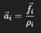\
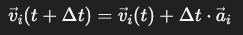\
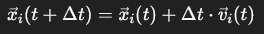

### Sources
Müller, M., Charypar, D., & Gross, M. (2003). Particle‑based fluid simulation for interactive applications. \
https://matthias-research.github.io/pages/publications/sca03.pdf \
\
Schuermann, Lucas V. (May 2016). Particle-Based Fluid Simulation with SPH. Writing. https://lucasschuermann.com/writing/particle-based-fluid-simulation
